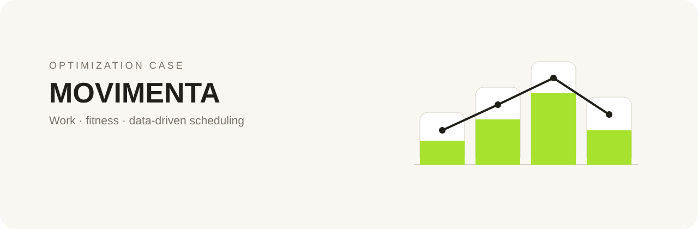

<p align="center">
  
</p>

<p align="center">
  
  
  
  
</p>

## Overview

**Movimenta** explores the relationship between professional routine and physical activity through data analysis and an optimization exercise. The notebook organizes activities by benefit and builds a practical schedule that balances work and fitness.

## Project flow

```text
activity data → benefit scoring → task ordering → optimized schedule → visual analysis
```

## Repository outputs

- `gs.ipynb` — complete analysis and optimization workflow.
- `tarefas_todas.csv` — complete task dataset.
- `tarefas_ordenadas_beneficio.csv` — activities ranked by benefit.
- `resumo_agenda.txt` — readable schedule summary.

## Concepts demonstrated

- structured data analysis in a notebook;
- ranking and prioritization rules;
- dynamic-programming-inspired optimization;
- reproducible CSV outputs;
- translation of an everyday problem into a data workflow.

## Explore

Open [`gs.ipynb`](gs.ipynb) to inspect the full code, charts, assumptions, and generated outputs.

Academic team project by Erik Kaiyu, Guilherme Vital and Lucas Guerreiro.

<p align="center"><sub>Optimization · wellbeing data · decision support</sub></p>
